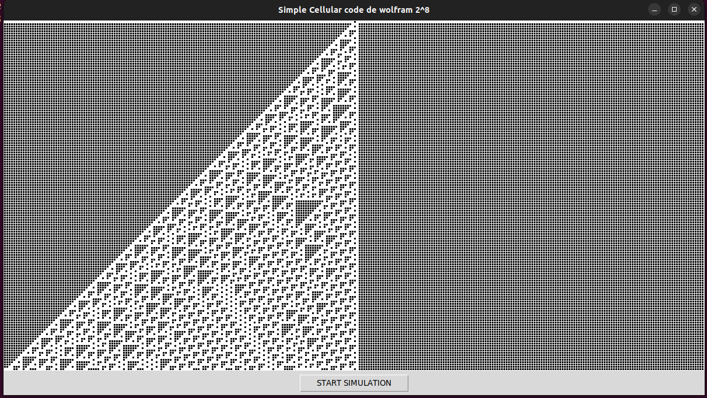
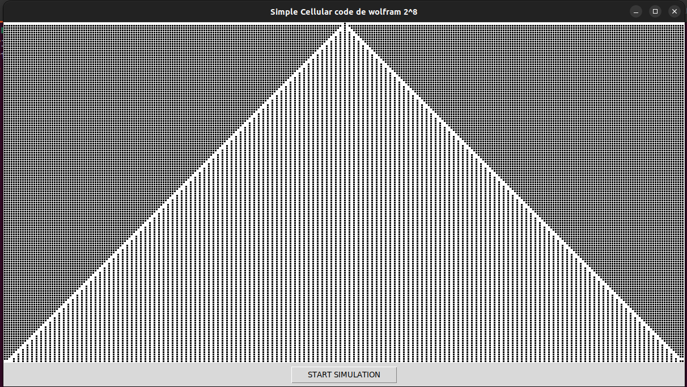

# Automate cellulaire simple

Les automates de cette famille sont dits élémentaires. On les désigne souvent par un entier entre 0 et 255 dont la représentation binaire est la suite des états pris par l'automate sur les motifs successifs 

```
Motif initial
111  110  101  100  011  010  001  000
```

Il existe 2^8 = 256 regles numerotes de 0 a 255.
Par convention on a une regle en fonction de l'ecriture en binaire sur 8 bits du nombre decimal. A l'etat t+1 le triplet du motif initial sera l'etat de la cellule en fonction de la position du bit du nombre X (8bits).

```
Exemple

regle 0 
111  110  101  100  011  010  001  000
 0    0    0    0    0    0    0    0

regle 10
111  110  101  100  011  010  001  000
 0    0    0    0    1    0    1    0

regle 31
111  110  101  100  011  010  001  000
 0    0    0    1    1    1    1    1
```

## Simulation
```
git clone https://github.com/bylaye/CellularAutomata && cd CellularAutomata/WolframCode
```

```
python
```
ou
```
python3
```
```
from SimpleCellular import SimpleCellular
```
```
max_line = 20
```
```
sc = SimpleCellular(rule=101, state_0=' ', state_1 = 'o', max_x=max_line, max_y=40)
```
```
>>> for _ in range(20):
...     sc.update()
... 
```
```
>>> print(sc)
                    o                   
ooooooooooooooooooo o oooooooooooooooooo
                  oooo                  
ooooooooooooooooo    o ooooooooooooooooo
                o oo oo                 
ooooooooooooooo oo oo o oooooooooooooooo
              oo oo oooo                
ooooooooooooo  oo oo   o ooooooooooooooo
            o   oo o o oo               
ooooooooooo o o  oooooo o oooooooooooooo
          ooooo       oooo              
ooooooooo     o ooooo    o ooooooooooooo
        o ooo oo    o oo oo             
ooooooo oo  oo o oo oo oo o oooooooooooo
      oo o   oooo oo oo oooo            
ooooo  ooo o    oo oo oo   o ooooooooooo
    o    ooo oo  oo oo o o oo           
ooo o oo   oo o   oo oooooo o oooooooooo
  oooo o o  ooo o  oo     oooo          
     ooooo    ooo   o ooo    o ooooooooo
```

rule = 90 avec 30 dans une grille de dimension 30x100

```
Python 3.10.12 (main, Nov 20 2023, 15:14:05) [GCC 11.4.0] on linux
Type "help", "copyright", "credits" or "license" for more information.
>>> from SimpleCellular import SimpleCellular
>>> sc = SimpleCellular(rule=90, state_0=' ', state_1 = 'o', max_x=30, max_y=100)
>>> for _ in range(30):
...     sc.update()
... 
>>> print(sc)
                                                  o                                                 
                                                 o o                                                
                                                o   o                                               
                                               o o o o                                              
                                              o       o                                             
                                             o o     o o                                            
                                            o   o   o   o                                           
                                           o o o o o o o o                                          
                                          o               o                                         
                                         o o             o o                                        
                                        o   o           o   o                                       
                                       o o o o         o o o o                                      
                                      o       o       o       o                                     
                                     o o     o o     o o     o o                                    
                                    o   o   o   o   o   o   o   o                                   
                                   o o o o o o o o o o o o o o o o                                  
                                  o                               o                                 
                                 o o                             o o                                
                                o   o                           o   o                               
                               o o o o                         o o o o                              
                              o       o                       o       o                             
                             o o     o o                     o o     o o                            
                            o   o   o   o                   o   o   o   o                           
                           o o o o o o o o                 o o o o o o o o                          
                          o               o               o               o                         
                         o o             o o             o o             o o                        
                        o   o           o   o           o   o           o   o                       
                       o o o o         o o o o         o o o o         o o o o                      
                      o       o       o       o       o       o       o       o                     
                     o o     o o     o o     o o     o o     o o     o o     o o                    

>>> 
```

## Simulation Interface Graphique
```
python3 UIGrid2D.py 137
```


```
python3 UIGrid2D.py 133
```

